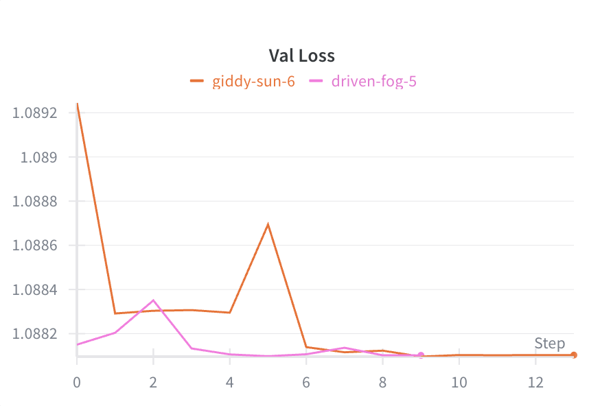
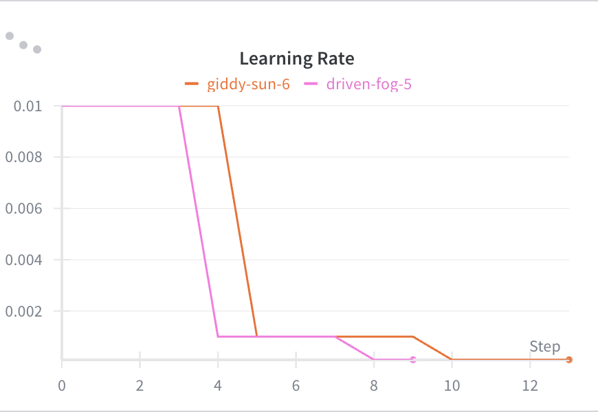
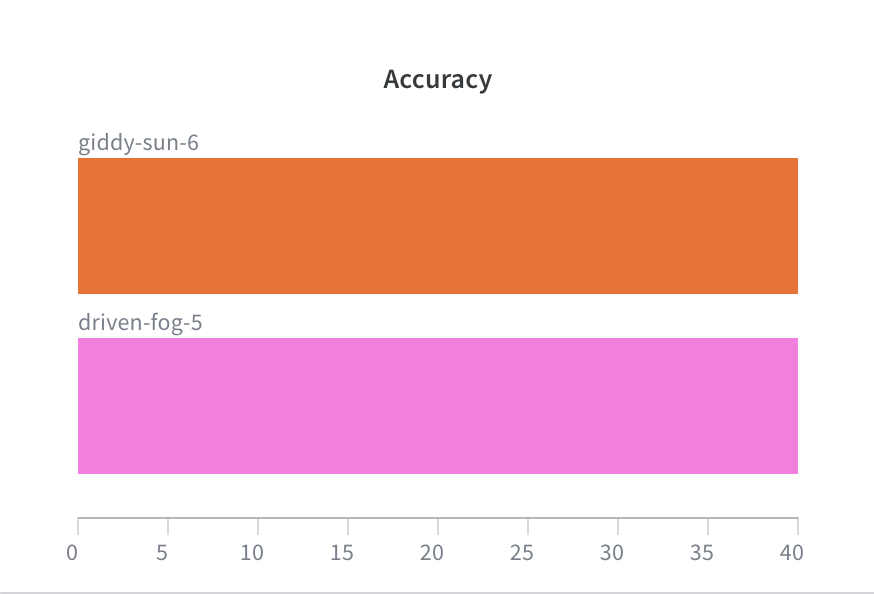

# SA-Transformer - Transformer Architecture for Sentiment Analysis

## Overview

This directory contains a **Transformer-based** implementation for sentiment analysis. The Transformer model treats each feature in the tabular data as a token in a sequence, leveraging self-attention mechanisms to learn complex feature interactions.

## Architecture

### Transformer Model for Tabular Data

The model uses a Transformer encoder architecture adapted for tabular data:

```
Input Features (batch, n_features)
    ↓
Feature Projection: (n_features, batch, 1) → (n_features, batch, d_model)
    ↓
Positional Encoding
    ↓
Transformer Encoder (num_layers × TransformerEncoderLayer)
    ↓
Global Pooling (mean over sequence)
    ↓
Classification Head
    ↓
Output Logits (batch, num_classes)
```

### Key Components

1. **Input Projection**: Maps each feature to `d_model` dimensions
2. **Positional Encoding**: Adds positional information to feature tokens
3. **Transformer Encoder**: Multi-head self-attention layers
4. **Global Pooling**: Aggregates sequence representation
5. **Classification Head**: Final fully connected layers for classification

### Model Hyperparameters

- `d_model`: Model dimension (default: 128)
- `nhead`: Number of attention heads (default: 8)
- `num_layers`: Number of transformer encoder layers (default: 3)
- `dim_feedforward`: Feedforward network dimension (default: 512)
- `dropout`: Dropout rate (default: 0.1)

## Directory Structure

```
SA-Transformer/
├── data/
│   └── SAAssignment2025/
│       ├── train.npy          # Training data
│       ├── test.npy            # Test data
│       ├── val.npy              # Validation data
│       └── class_names.npy      # Class names
├── SA-Transformer/            # Main code directory
│   ├── model.py               # Transformer model architecture
│   ├── train.py               # Training script
│   ├── preprocess.py          # Data preprocessing utilities
│   ├── convert.py             # PyTorch to ONNX conversion
│   ├── onnxtest.py            # ONNX model testing
│   ├── config.yaml            # Configuration file
│   ├── SA-Transformer.pth     # Trained model weights
│   ├── scaler.pkl             # StandardScaler
│   └── wandb/                 # WandB logs
├── models/                    # Additional model checkpoints
├── helper_functions.py        # Utility functions
├── pyproject.toml             # Project dependencies
├── README.md                  # This file
└── DOCUMENTATION.md           # Comprehensive documentation
```

## Dependencies

Uses the same dependencies as the main project. Ensure you have:
- PyTorch >= 2.9.1
- numpy, pandas, scikit-learn
- wandb (for experiment tracking)
- onnx, onnxruntime (for model deployment)

## Usage
### 0. Dataset
Dataset from huggingface
URL: https://huggingface.co/datasets/mteb/tweet_sentiment_extraction

### 1. Training

Train the Transformer model:

```bash
cd SA-Transformer/SA-Transformer
uv run train.py
# or alternatively: python train.py
```

**What happens:**
- Loads data from `../SAAssignment2025/data/SAAssignment2025/`
- Preprocesses data (normalization)
- Creates Transformer model with specified hyperparameters
- Trains with early stopping
- Saves best model to `SA-Transformer.pth`
- Evaluates on test set

**Output:**
- `SA-Transformer.pth` - Best model weights
- `scaler.pkl` - StandardScaler for normalization
- WandB logs

### 2. Model Conversion to ONNX

Convert trained model to ONNX format:

```bash
cd SA-Transformer/SA-Transformer
uv run convert.py
# or alternatively: python convert.py
```

**Requirements:**
- `SA-Transformer.pth` must exist (trained model)

**Output:**
- `SA-Transformer.onnx` - ONNX model file

### 3. ONNX Model Testing

Test ONNX model performance:

```bash
cd SA-Transformer/SA-Transformer
uv run onnxtest.py
# or alternatively: python onnxtest.py
```

**Output:**
- Accuracy percentage
- Inference time metrics
- Throughput (samples/second)

## Configuration

Edit `config.yaml` to adjust hyperparameters:

```yaml
# Training hyperparameters
batch_size: 128
learning_rate: 0.001  # Lower LR for Transformer
num_epochs: 30

# Transformer architecture
d_model: 128          # Model dimension
nhead: 8              # Number of attention heads
num_layers: 3         # Number of transformer encoder layers
dim_feedforward: 512  # Feedforward network dimension
dropout: 0.1          # Dropout rate
max_seq_len: 1000     # Maximum sequence length
```

## Model Architecture Details

### Positional Encoding

Uses sinusoidal positional encoding to provide sequence position information to the model. This helps the Transformer understand the order of features.

### Transformer Encoder

Each encoder layer consists of:
- **Multi-Head Self-Attention**: Allows the model to attend to different features
- **Feedforward Network**: Two linear layers with GELU activation
- **Residual Connections**: Helps with gradient flow
- **Layer Normalization**: Stabilizes training

### Classification Head

After global pooling, a two-layer MLP with GELU activation and dropout outputs class logits.

## Advantages of Transformer Architecture

1. **Feature Interactions**: Self-attention mechanism learns complex relationships between features
2. **Parallel Processing**: Unlike RNNs, Transformers process all features in parallel
3. **Scalability**: Can handle variable-length feature sequences
4. **Interpretability**: Attention weights can show which features are important

## Comparison with MLP

| Aspect | MLP | Transformer |
|--------|-----|------------|
| Architecture | Feedforward | Self-attention |
| Feature Interactions | Limited | Rich (via attention) |
| Parameters | Fewer | More |
| Training Time | Faster | Slower |
| Interpretability | Low | Higher (attention weights) |
| Best For | Simple patterns | Complex feature relationships |

## Data Requirements

**✅ Uses the Same Dataset as MLP Implementation**

The Transformer model uses the **exact same preprocessed dataset** as the MLP architecture in `SAAssignment2025/SA/`. No additional data preparation is needed.

**Data Paths:**
- Training data: `../data/SAAssignment2025/train.npy`
- Test data: `../data/SAAssignment2025/test.npy`
- Validation data: `../data/SAAssignment2025/val.npy`
- Class names: `../data/SAAssignment2025/class_names.npy`

**Dataset:**
- https://huggingface.co/datasets/mteb/tweet_sentiment_extraction

**Note:** The dataset is in the `data/` directory at the project root, matching the structure of `SAAssignment2025/`.

**Data Format:** `(n_samples, n_features + 1)` where the last column contains labels.

**Note:** If you haven't preprocessed the data yet, run the preprocessing script in `SAAssignment2025/data/SAAssignment2025/preprocess_csv.py` first.

## Training Features

- **Early Stopping**: Stops training if validation loss doesn't improve for 5 epochs
- **Learning Rate Scheduling**: ReduceLROnPlateau reduces LR when validation loss plateaus
- **Gradient Clipping**: Prevents exploding gradients (max_norm=1.0)
- **WandB Integration**: Tracks training metrics
- **Model Checkpointing**: Saves best model based on validation loss

## Performance Considerations

### Training
- **GPU Recommended**: Transformer training benefits significantly from GPU acceleration
- **Memory Usage**: Higher than MLP due to attention mechanisms
- **Batch Size**: Adjust based on GPU memory (default: 128)

### Inference
- **ONNX Runtime**: Faster inference than PyTorch
- **CUDA Provider**: Use GPU for faster ONNX inference
- **Batch Processing**: Process multiple samples simultaneously

## Troubleshooting

### Out of Memory
- Reduce `batch_size` in config.yaml
- Reduce `d_model` or `dim_feedforward`
- Reduce `num_layers`

### Slow Training
- Use GPU if available
- Reduce model size (d_model, num_layers)
- Increase batch size if memory allows

### Poor Performance
- Try different learning rates (0.0001 to 0.01)
- Adjust dropout rate
- Increase model capacity (d_model, num_layers)
- Train for more epochs

## Notes

- The Transformer model is more complex than MLP and may require more training time
- Attention mechanisms allow the model to learn which features are important
- Positional encoding helps the model understand feature order
- Global pooling aggregates the sequence representation before classification

## Future Improvements

Potential enhancements:
- Add feature importance visualization using attention weights
- Implement different pooling strategies (max, attention-based)
- Add layer-wise learning rate decay
- Experiment with different positional encoding strategies
- Add model ensembling with MLP

## WanDB Evaluatation






